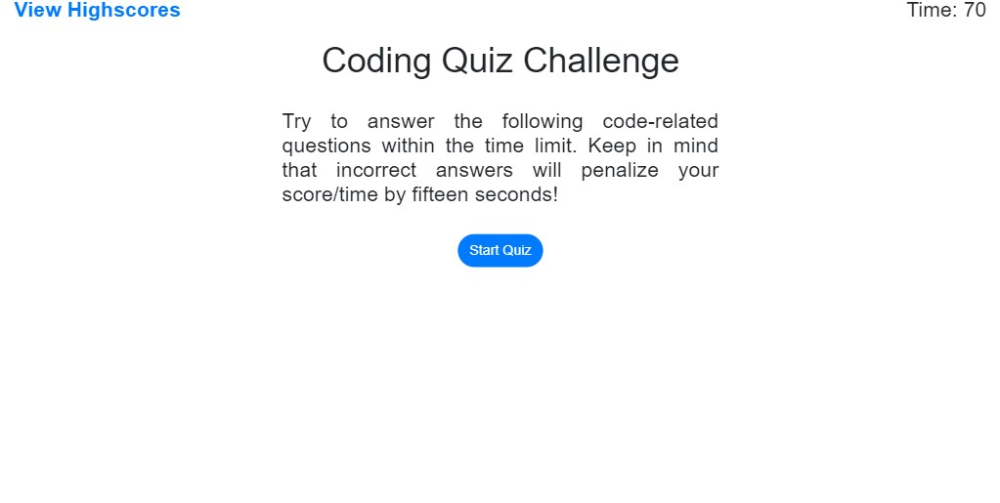
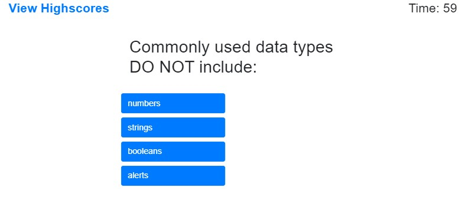
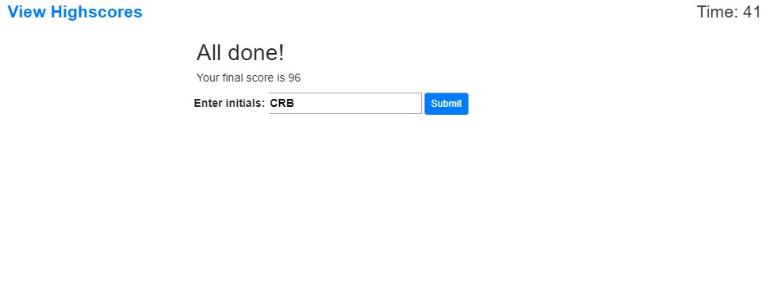
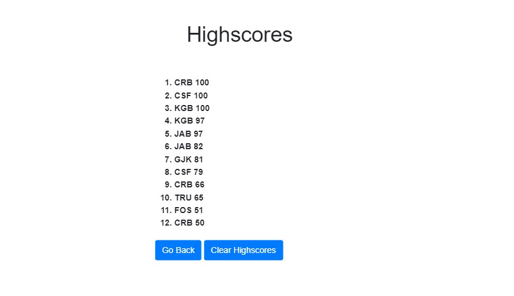
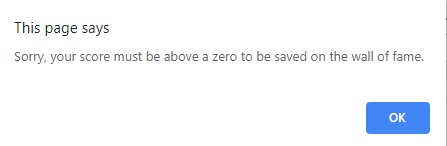
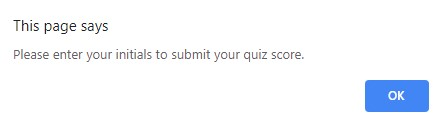

# Homework-04-Web-APIs
A timer-based quiz application that stores high scores client-side

## Table of contents
* [General info](#general-info)
* [Instruction](#instructions)
* [Screenshots](#screenshots)
* [Features](#features)

## General info
Unit 04 Web APIs Homework: Code Quiz
In this homework assignment, your challenge is to build a code quiz with multiple-choice questions.

Add more general information about project. What the purpose of the project is? Motivation?

## Instructions
As a coding bootcamp student
I want to take a timed quiz on JavaScript fundamentals that stores high scores
so that I can gauge my progress compared to my peers

## Screenshots

## Features
List of features ready and TODOs for future development
* Green/Red colored answer indicator displayed for correct or incorrect answers
* High scores are saved to local storage and displayed in descending order on another window
* Answers are shuffled each time you take the quiz

To-do list:
* Create maintenance screen so user can add/edit quiz questions
* Add audio clips to play on correct/incorrect answers
* Customize the application theme.
* Create multiple quizzes and an option for users to choose between them.
